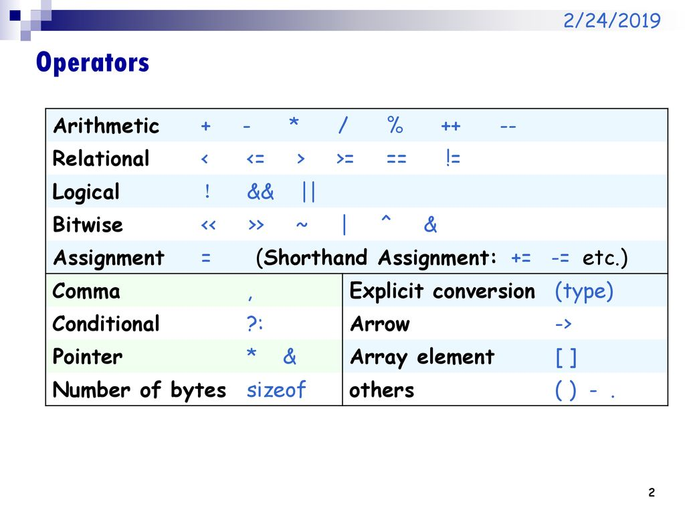
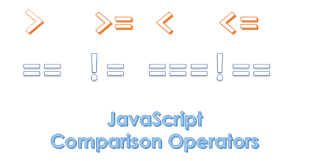
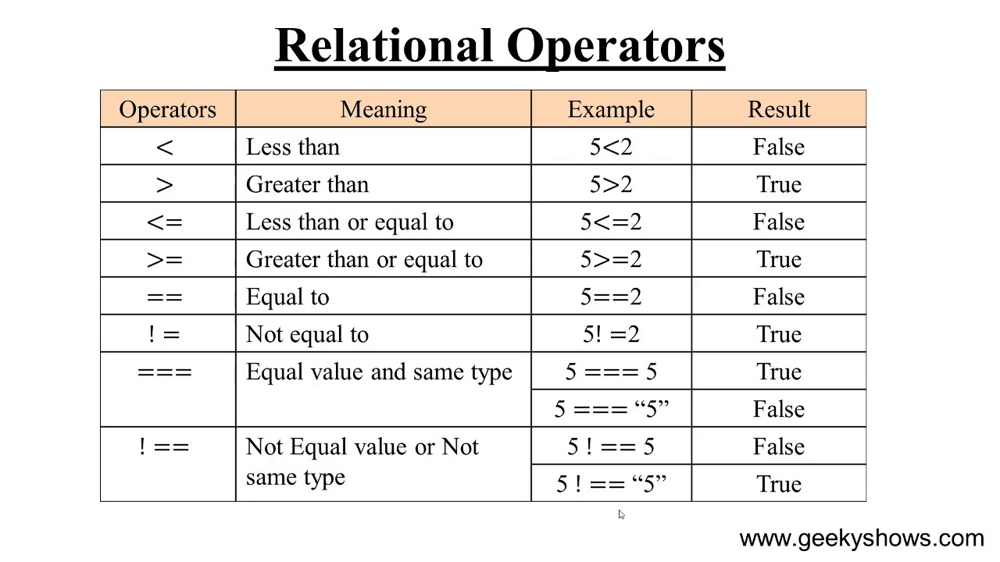

# *Expressions and operators:
**1.Operators:**

-JavaScript has the following types of operators:

* *Assignment operators*(=): it _**assigns**_ a value to its left operand based on the value of its right operand.
That is, x = y assigns the value of y to x.

* *Comparison operators*: it compares its operands and returns a logical value based on whether the comparison is true. The operands can be numerical, string, logical, or object values

* *Arithmetic operators* : it takes numerical values (either literals or variables) as their operands and returns a single numerical value.

* *Bitwise operators* : it  treats their operands as a set of 32 bits (zeros and ones), rather than as decimal, hexadecimal, or octal numbers.

* *Logical operators*(&& and ||):typically used with Boolean (logical) values; when they are, they return a Boolean value. 
operators actually return the value of one of the specified operands.
* *String operators*

* *Conditional (ternary)* : it is the only JavaScript operator that takes **three operands**. The operator can have one of two values based on a condition.
operator

* *Comma operator*: (,) evaluates both of its operands and returns the value of the last operand. This operator is primarily used inside a for loop, to allow multiple variables to be updated each time through the loop. 

* *Unary operators*: it is an operation with only one operand.

* *Relational operators*: it compares its operands and returns a Boolean value based on whether the comparison is true.

![jj]
(jj.png)

For more information visit
[developer.mozilla](https://developer.mozilla.org/en-US/docs/Web/JavaScript/Guide/Expressions_and_Operators).

## Functions:
In JavaScript, functions are **first-class objects**, because they can have properties and methods just like any other object.

A function in JavaScript is similar to a *procedure*—a set of statements that performs a task or calculates a value, but for a procedure to qualify as a function, it should take some input and return an output where there is some obvious relationship between the input and the output.

### *Defining functions:
-Functions are also called a **function declaration**, or **function statement**.
